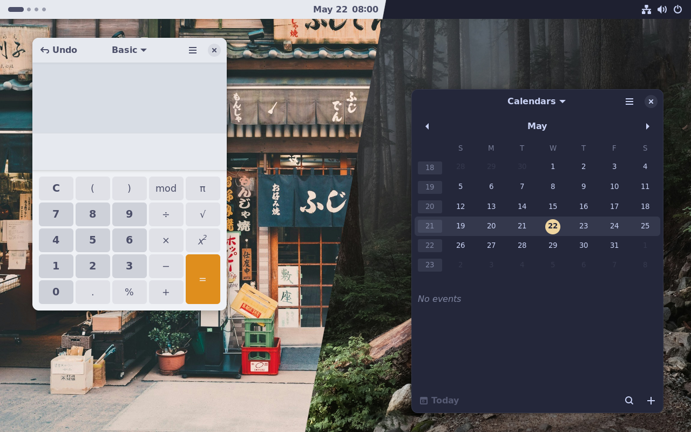
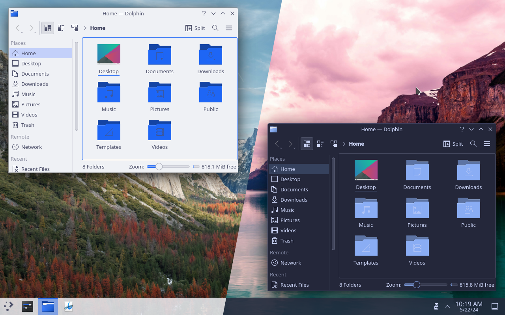

# Stylix

Stylix is a NixOS module which applies the same colour scheme, font and
wallpaper to a range of applications and desktop environments.

## What's this?

[base16.nix](https://github.com/SenchoPens/base16.nix#readme) allows you to
import colours from [base16](https://github.com/chriskempson/base16#readme)
into Nix code. Stylix takes this a step further:

- Automatically colours and changes the font of apps
- Sets your wallpaper
- Exports the colour scheme to be used manually for anything we missed
- Can also generate themes based on an image

For those not familiar with [NixOS](https://nixos.org/) and
[Home Manager](https://github.com/nix-community/home-manager#readme):

- NixOS is a Linux distribution
- Home Manager is a program which runs anywhere
- Both use the Nix language and package manager
- Both let you install programs and change settings via code

Stylix supports either NixOS + Home Manager, or Home Manager on its own.
Certain features are only available with NixOS.

## Resources

Please refer to the [Stylix book](https://danth.github.io/stylix/)
for instructions and a list of supported apps.

For a visual guide, watch the [*Ricing Linux Has Never Been Easier | NixOS +
Stylix*](https://youtu.be/ljHkWgBaQWU) YouTube video by
[Vimjoyer](https://www.youtube.com/@vimjoyer).

> [!NOTE]
>
> It's now necessary to include `stylix.enable = true` in your configuration
> for any other settings to take effect. This is not mentioned in the video
> linked above.

If you have any questions, you are welcome to
join our [Matrix room](https://matrix.to/#/#stylix:danth.me),
or ask on [GitHub Discussions](https://github.com/danth/stylix/discussions).

## Example configurations

### GNOME 46

Photos by [Clay Banks](https://unsplash.com/photos/three-bicycles-parked-in-front-of-building-hwLAI5lRhdM)
and [Derrick Cooper](https://unsplash.com/photos/brown-road-in-forest-during-daytime-L505cPnmIds).

Try a live demo of this theme by running
`nix run github:danth/stylix#testbed-gnome-light` or
`nix run github:danth/stylix#testbed-gnome-dark`.

### KDE Plasma 5

Photos by [Aniket Deole](https://unsplash.com/photos/mountain-surrounded-by-trees-under-cloudy-sky-T-tOgjWZ0fQ)
and [Tom Gainor](https://unsplash.com/photos/landscape-photography-of-body-of-water-overlooking-mountain-range-ZqLeQDjY6fY).

KDE theming is still a work in progress - so some manual steps may be needed
to apply the settings completely.
