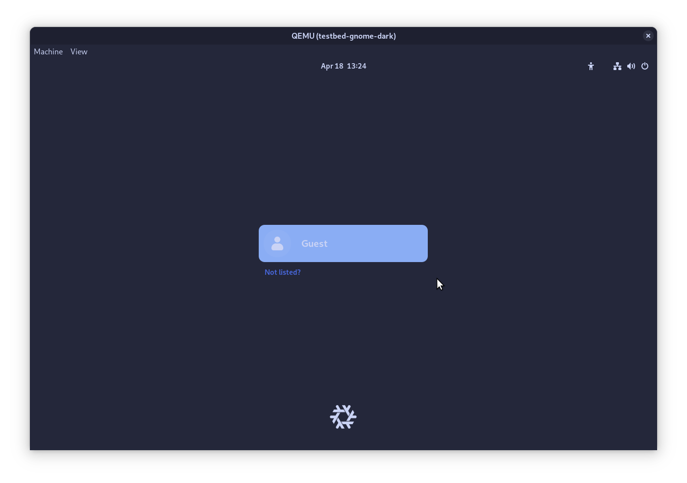

# Testbeds

Stylix provides a suite of virtual machines which can be used to test and
preview themes without installing the target to your live system.

These can be particularly helpful for:

- Working on targets before the login screen, since you can avoid closing your
editor to see the result.
- Developing for a different desktop environment than the one you normally use.
- Reducing the risk of breaking your system while reviewing pull requests.

Testbeds are also built by GitHub Actions for every pull request. This is less
beneficial compared to running them yourself, since it cannot visually check the
theme, however it can catch build failures which may have been missed otherwise.

## Creation

Testbeds are defined at `/modules/«module»/testbeds/«testbed».nix` and are are
automatically loaded as a NixOS module with options such as `stylix.image`
already defined. The testbed should include any options necessary to install the
target and any supporting software - for example, a window manager.

### Special Options

Testbeds are given a special set of options which configure for common testbed
uses.

- `config.stylix.testbed`
  - `enable` defaults to true; allows for conditionally disabling a testbed
  - `ui` and all of its suboptions are optional. Setting any will enable a
    graphical environment.
    - `command` takes a string command to be run once the graphical environment
      has loaded
    - `application` takes a desktop application to be run once the graphical
      environment has loaded. If one of its suboptions is set, all must be.
      - `name` takes the string name of the desktop application
      - `package` takes the package which provides the `.desktop` file

### Home Manager

If the target can only be used through Home Manager, you can write a Home
Manager module within the NixOS module using the following format:

```nix
{ lib, ... }:
{
  home-manager.sharedModules = lib.singleton {
    # Write Home Manager options here
  };
}
```

Using `home-manager.sharedModules` is preferred over `home-manager.users.guest`
since it allows us to easily change the username or add additional users in the
future.

Once the module is complete, use `git add` to track the file, then the new
packages will be [available to use](#usage).

## Usage

You can list the available testbeds by running this command from anywhere within
the repository:

```console
user@host:~$ nix flake show
github:nix-community/stylix
└───packages
    └───x86_64-linux
        ├───doc: package 'stylix-book'
        ├───palette-generator: package 'palette-generator'
        ├───"testbed:gnome:cursorless": package 'testbed-gnome-cursorless'
        ├───"testbed:gnome:dark": package 'testbed-gnome-dark'
        ├───"testbed:gnome:imageless": package 'testbed-gnome-imageless'
        ├───"testbed:gnome:light": package 'testbed-gnome-light'
        ├───"testbed:gnome:schemeless": package 'testbed-gnome-schemeless'
        ├───"testbed:kde:cursorless": package 'testbed-kde-cursorless'
        ├───"testbed:kde:dark": package 'testbed-kde-dark'
        ├───"testbed:kde:imageless": package 'testbed-kde-imageless'
        ├───"testbed:kde:light": package 'testbed-kde-light'
        └───"testbed:kde:schemeless": package 'testbed-kde-schemeless'
```

(This has been edited down to only the relevant parts.)

To start a testbed, each of which is named in the format
`testbed:«module»:«testcase»`, run the following command:

```console
user@host:~$ nix run .#testbed:«module»:«testcase»
```

Any package with a name not fitting the given format is not a testbed, and may
behave differently with this command, or not work at all.

Once the virtual machine starts, a window should open, similar to the screenshot
below. The contents of the virtual machine will vary depending on the target you
selected earlier.



If the testbed includes a login screen, the guest user should log in
automatically when selected. Depending on the software used, you may still be
presented with a password prompt - in which case you can leave it blank and
proceed by pressing enter.
