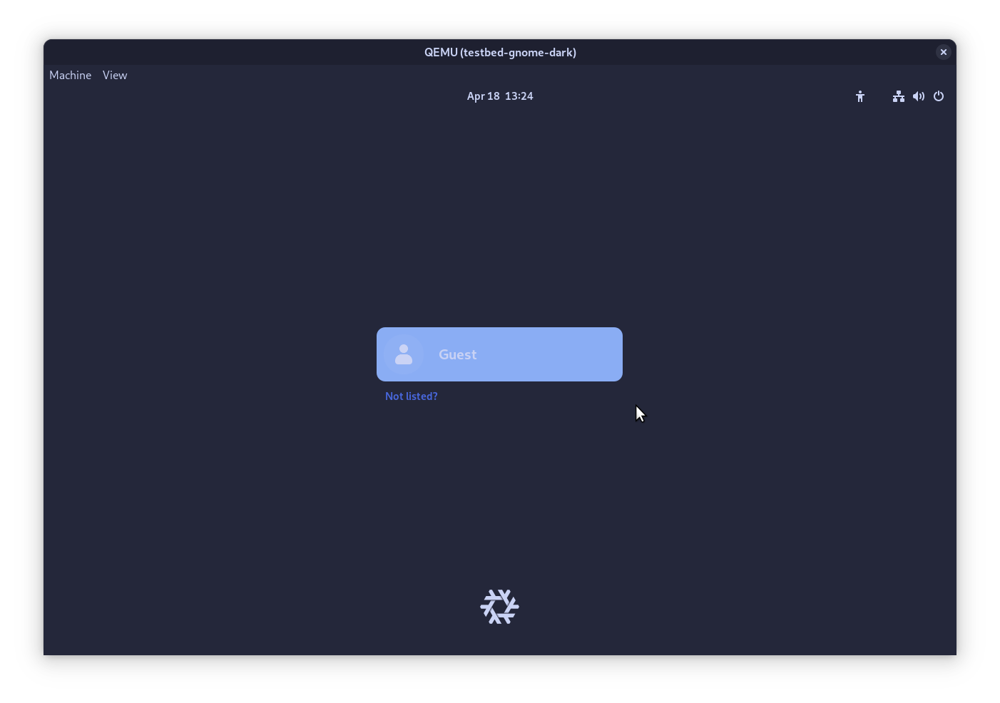

# Testbeds

Stylix provides a suite of virtual machines which can be used to test and
preview themes without installing the target to your live system.

These can be particularly helpful for:

- Working on targets before the login screen, since you can avoid closing
  your editor to see the result.
- Developing for a different desktop environment than the one you normally use.
- Reducing the risk of breaking your system while reviewing pull requests.

Testbeds are also built by GitHub Actions for every pull request. This is less
beneficial compared to running them yourself, since it cannot visually check
the theme, however it can catch build failures which may have been missed
otherwise.

## Creation

New testbeds are defined by creating a file called `testbed.nix` within the
folder for the corresponding target. This file will automatically be loaded
as a NixOS module, with options such as `stylix.image` already defined.
The module should include any options necessary to install the target and
any supporting software - for example, a window manager.

If the target can only be used through Home Manager, you can write a
Home Manager module within the NixOS module using the following format:

```nix
{
    home-manager.sharedModules = [{
        # Write Home Manager options here
    }];
}
```

Using `home-manager.sharedModules` is preferred over `home-manager.users.guest`
since it allows us to easily change the username or add additional users in
the future.

Once the module is complete, use `git add` to track the file, then the new
packages will be [available to use](#usage).

## Usage

You can list the available testbeds by running this command from anywhere
within the repository:

```console
user@host:~$ nix flake show
github:danth/stylix
└───packages
    └───x86_64-linux
        ├───docs: package 'stylix-book'
        ├───palette-generator: package 'palette-generator'
        ├───testbed-gnome-dark: package 'testbed-gnome-dark'
        ├───testbed-gnome-light: package 'testbed-gnome-light'
        ├───testbed-kde-dark: package 'testbed-kde-dark'
        └───testbed-kde-light: package 'testbed-kde-light'
```

(This has been edited down to only the relevant parts.)

To start a testbed, each of which is named in the format
`testbed-«target»-«polarity»`, run the following command:

```console
user@host:~$ nix run .#testbed-«target»-«polarity»
```

Any package with a name not fitting the given format is not a testbed,
and may behave differently with this command, or not work at all.

Once the virtual machine starts, a window should open, similar to the screenshot
below. The contents of the virtual machine will vary depending on the target you
selected earlier.



If the testbed includes a login screen, the guest user should log in
automatically when selected. Depending on the software used, you may still be
presented with a password prompt - in which case you can leave it blank and
proceed by pressing enter.
